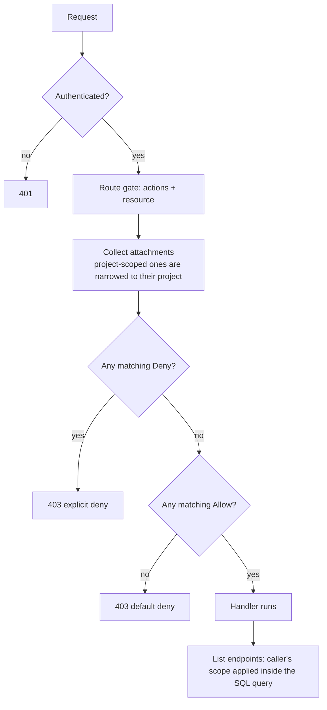

# IAM authorization

This is the one page to read to understand how Paca decides who may do what, from the concepts to the exact action and resource names. It links out to the deeper references:

- [Roles and policies](roles-and-policies.md): writing policies, the editors and worked examples.
- [Authorization architecture](../architecture/authorization.md): how the API enforces it, and how to add a route safely.
- [Roles and policies API](../api/roles-and-policies.md): the endpoints.
- [Release notes](../releases/2026-10-iam-authorization.md): upgrading from the old permission model.

## Concepts

| Term | Meaning |
|---|---|
| **Principal** | Who is asking: a **user** or an **agent** (a global agent, or a project agent acting as a project member). |
| **Action** | What they want to do, written `domain:verb`, for example `tasks:write`. |
| **Resource** | What they want to do it to, a path such as `project/<id>/task/<id>`. |
| **Policy** | A JSON document of *statements*. Each statement has an `effect` (`Allow` or `Deny`), `actions`, `resources` and optional `conditions`. |
| **Role** | A named policy (`name`, `description`, `policy`). Roles are the only thing that grants access. |
| **Attachment** | The link between a role and a principal. It is either **platform-wide** or **scoped to one project**. |

Key rules:

- A principal can hold **any number of roles**. Their statements are combined.
- **Nothing is allowed by default.** A request needs a matching `Allow`.
- **An explicit `Deny` always wins**, whatever else allows the request.
- **Role names mean nothing.** Calling a role `ADMIN` grants nothing; only its policy counts. The `role` value in a login token is a display hint and is never used to decide access.
- Edits take effect on the principal's **next request**.

```json
{
  "version": "2026-10-01",
  "statements": [
    { "sid": "ReadTasks", "effect": "Allow",
      "actions": ["tasks:read", "sprints:read"],
      "resources": ["project/7c1e0000-0000-0000-0000-000000000000/*"] },
    { "sid": "NoProdShell", "effect": "Deny",
      "actions": ["environments:connect"],
      "resources": ["project/*/environment/*"],
      "conditions": { "StringEquals": { "environment.type": "kubernetes" } } }
  ]
}
```

### Platform-wide and project-scoped attachments

- A **platform-wide** attachment (set in Administration on a user or a global agent) applies everywhere the role's resources reach.
- A **project-scoped** attachment (set on a project's Team page for a member or project agent) applies **only inside that project**. Paca intersects every statement's resources with `project/<that project>`, so a role written on `project/*` or on another project never reaches beyond the project it is attached in.
- `project_members` rows record membership (assignees, chat sessions) but carry no permissions. A member with no attached role sees nothing in the project.

## How a request is decided

```text
request (user or agent, API key or JWT)
   |
   v
authentication  ----- no/invalid credentials -----------------> 401
   |
   v
route gate (router/guards.go): the route declares ONE OR MORE actions
and the resource they apply to; ALL must be allowed
   |
   v
evaluator (iam.Evaluate)
   1. collect the principal's attachments
        platform-wide: applies as written
        project-scoped: resources intersected with project/<id>
   2. keep statements whose action AND resource match
      and whose conditions all hold
   3. any matching Deny ----------------------------------------> refused
   4. else any matching Allow ----------------------------------> allowed
   5. else (default deny) --------------------------------------> refused
   fail closed: unknown action, malformed stored policy,
   store or attribute-loader error ----------------------------> refused
   |
   v
refused -> 403 FORBIDDEN          allowed -> handler runs
```



A few consequences worth knowing:

- Gates run **before** the handler, so the answer does not depend on handler logic. See [403 vs 404](#403-vs-404).
- Routes that act on one entity (a task, an agent, an environment, a document...) are checked **on that entity**, so a `Deny` or a condition on it applies to every route that touches it.
- Creating or moving something is judged on the attributes the request carries, and an update that changes an attribute must be allowed on both the old and the new value.
- A named action granted on a platform resource (for example `projects:write` on `project`) does **not** open the inside of any project. Only `*` on `*`, or statements on `project/...`, reach inside projects.

## Actions reference

`domain:verb`. `*` matches every action and `domain:*` every action of a domain; no other wildcard form exists. An action that is not in the registry is rejected when a role is saved. The live list is `GET /roles/actions`.

| Domain | Action | Meaning |
|---|---|---|
| `users` | `users:read` | List and view user accounts. |
| | `users:write` | Create and edit users, including resetting any user's password. **Root-equivalent.** |
| | `users:delete` | Delete user accounts. |
| `roles` | `roles:read` | View roles and their policies. |
| | `roles:write` | Create, edit and delete roles; choose the default role. **Root-equivalent.** |
| | `roles:assign` | Attach or detach roles, like AWS IAM `iam:PassRole`: the statement's resource says which roles. **Root-equivalent when granted on `*` or `role/*`**; scope it with resources. |
| `projects` | `projects:read` | See a project and the project list. |
| | `projects:write` | Edit project settings. |
| | `projects:create` | Create projects. |
| | `projects:delete` | Delete projects. |
| `project.members` | `project.members:read` | View a project's team. |
| | `project.members:write` | Add, remove and update members and project agents. Changing a member's roles is `roles:assign`, not this. |
| `project.activities` | `project.activities:read` | Read the project activity log. |
| `project` | `project:export` | Export a project. |
| `tasks` | `tasks:read` | View tasks. |
| | `tasks:write` | Create and edit tasks, comments and task links. |
| `project.settings.task_types` | `project.settings.task_types:write` | Edit the project's task types. |
| `project.settings.task_statuses` | `project.settings.task_statuses:write` | Edit the project's task statuses. |
| `project.settings.custom_fields` | `project.settings.custom_fields:write` | Edit the project's custom fields. |
| `sprints` | `sprints:read`, `sprints:write` | View / manage sprints. |
| `views` | `views:read`, `views:write` | View / manage board, backlog and timeline views. |
| `docs` | `docs:read`, `docs:write` | View / manage documents and folders. |
| `workflows` | `workflows:read`, `workflows:write` | View / manage automations. |
| `annotations` | `annotations:read` | View page annotations. |
| | `annotations:write` | Create and edit annotations. |
| | `annotations:resolve` | Resolve annotations. |
| `agents` | `agents:read`, `agents:write` | View / configure agents. |
| `conversations` | `conversations:read`, `conversations:write` | View / take part in agent chats. |
| `environments` | `environments:read` | View environments. |
| | `environments:write` | Create and edit environments. |
| | `environments:connect` | Open an interactive shell or manage SSH keys on an environment. |
| `settings` | `settings:write` | Change workspace settings. |
| `settings.sso` | `settings.sso:write` | Configure SSO providers. **Root-equivalent.** |
| `plugins` | `plugins:read`, `plugins:write` | View / install and manage plugins. |
| _plugin namespace_ | `<namespace>:<verb>` | Declared by an installed plugin, for example `time_logging:manage_all`. The namespace is the last segment of the plugin id with `-` replaced by `_`. Listed while the plugin is installed. |

"Root-equivalent" means whoever holds the action can give themselves everything, so hold it only where you would hold `*`. Only `SUPER_ADMIN` is seeded with them.

## Resources reference

Resource names are paths. A `*` in the middle matches exactly one segment; a trailing `*` matches everything below, **and the parent itself** (`project/p1/*` also covers `project/p1`).

| Form | Names |
|---|---|
| `*` | Everything. |
| `project` | The project collection (list and create projects). |
| `project/<id>` | One project. |
| `project/<id>/task/<id>` | One task. |
| `project/<id>/sprint/<id>` | One sprint. |
| `project/<id>/doc/<id>` | One document. |
| `project/<id>/view/<id>` | One view. |
| `project/<id>/workflow/<id>` | One automation. |
| `project/<id>/annotation/<id>` | One annotation. |
| `project/<id>/conversation/<id>` | One conversation. |
| `project/<id>/agent/<id>` | One agent in a project. |
| `project/<id>/environment/<id>` | One environment in a project. |
| `project/<id>/role/<id>` | One role owned by the project. |
| `project/<id>/plugin/<pluginId>` | A plugin's own actions inside a project. |
| `user/<id>`, `role/<id>`, `agent/<id>`, `plugin/<id>` | Platform-level users, roles, global agents and plugins. |
| `settings`, `sso` | Workspace settings and SSO providers. |

Project-wide actions are checked on `project/<id>` for list and create requests and on `project/<id>/<kind>/<id>` for a request about one entity, so give a project role `project/<id>/*` (which covers both). Platform actions are checked on their platform root: `users` on `user/*`, `roles` on `role/*`, `plugins` on `plugin/*`, `agents` on `agent/*`, `settings` on `settings`, `settings.sso` on `sso`, `projects` on `project`. A name with an empty segment, or whose first segment is not `project`, `user`, `role`, `plugin`, `agent`, `settings` or `sso`, is rejected on save.

## Conditions and attributes

Shape: `"conditions": { "<operator>": { "<key>": <value or list> } }`. Every condition of a statement must hold.

| Operator | True when |
|---|---|
| `StringEquals` | the attribute equals one of the values |
| `StringNotEquals` | the attribute equals none of the values |
| `StringLike` | the attribute matches a value (`*` any run of characters, `?` one character) |
| `In` / `NotIn` | the attribute is / is not in the list |
| `Bool` | the attribute equals `true` or `false` |

Positive operators match if **any** value of a multi-valued attribute matches; negated ones (`StringNotEquals`, `NotIn`) only if **none** does. A missing attribute makes positive operators false and negated ones true. An unknown operator never grants, and in a `Deny` it always applies.

Condition keys are *declared attributes* (`GET /roles/attribute-schema`). A key tied to a resource kind must fit at least one resource of its statement, otherwise the policy is rejected.

| Key | Applies to | Multi-valued | Value |
|---|---|---|---|
| `principal.id` | any | no | The caller's id. |
| `principal.type` | any | no | `user` or `agent`. |
| `resource.id` | any | no | The id of the resource being accessed. |
| `task.sprint_id` | task | no | The task's sprint. |
| `task.status_id` | task | no | The task's status. |
| `task.type_id` | task | no | The task's type. |
| `task.assignee_id` | task | yes | The task's assignees (users or agents). |
| `view.sprint_id` | view | no | The sprint a view belongs to; absent for backlog and timeline views. |
| `doc.folder_id` | doc | no | The document's folder. |
| `doc.ancestor_folder_ids` | doc | yes | The folder and all its parents, so "in folder ABC" includes subfolders. |
| `agent.environment_id` | agent | no | The agent's default environment. |
| `environment.type` | environment | no | `docker` or `kubernetes`. |
| `conversation.environment_id` | conversation | no | The environment a chat runs in. |

## Role scopes

There is one kind of role, but where it lives decides where it can be used.

| Kind | Created in | May name | Can be attached |
|---|---|---|---|
| **Workspace role** | Administration, Roles | Any resource: `*`, one or several projects (`project/<id>/*`), all projects (`project/*`), platform roots. | Platform-wide to users and global agents, and per project to members. |
| **Project-owned role** | A project's Roles page | Only its own project: `project/<ownId>` and `project/<ownId>/...`. Anything else is `422 ROLE_POLICY_INVALID` at `statements[i].resources[j]`. | Only inside its project. |
| **Project template** | Administration, Roles (a workspace role) | Resources that **all** have a wildcard project segment (`project/*`, `project/*/task/*`). | **Only per project.** Attaching it platform-wide, or making it the default, is refused with `ROLE_NOT_ATTACHABLE`, because it would grant its powers in every project. The Administration role pickers do not offer it. |

The project-resource rule exists so a project administrator cannot write a policy about other projects. Migration `000067` rewrote existing project-owned roles to comply. To give one role access to several projects, create a **workspace** role that names them (`project/<id>/*`); unlike a template it can be attached platform-wide and reaches exactly those projects.

A project's Roles page lists the project's own roles plus the workspace roles already attached to someone inside that project (not every workspace role).

## Built-in roles

Paca ships these roles. Startup creates any that is missing and **never overwrites** an existing role's policy or description, so your edits survive restarts and upgrades. Built-in roles are **editable** by anyone allowed to write roles (the escalation guard still applies) but **cannot be deleted** (`409 ROLE_IS_SYSTEM`).

| Role | Kind | Policy |
|---|---|---|
| `SUPER_ADMIN` | Platform, system | `*` on `*`. The only role seeded with the root-equivalent actions. |
| `ADMIN` | Platform, system | Runs the workspace: `agents:*`, `plugins:*`, `projects:*`, `users:*`, `settings:write` and `roles:read`, on the platform roots (`user`, `user/*`, `role`, `role/*`, `plugin`, `plugin/*`, `settings`, `sso`, `agent`, `agent/*`, `project`). It can read roles but not define or assign them. `users:*` includes `users:write`, which can reset any password, so grant `ADMIN` with that in mind. |
| `USER` | Platform, system, **default** | `users:read` on the platform roots. Every new user and new global agent starts with the default role. |
| `Admin` | Project, system | `projects:read` on the project and `*` on `project/<id>/*`. |
| `Editor` | Project | `projects:read` on the project; read/write on agents, annotations (including resolve), conversations, docs, environments (including connect), sprints, tasks, views and workflows, plus `project.members:read`, on `project/<id>/*`; `roles:read` on `project/<id>/role/*`. |
| `Viewer` | Project | `projects:read` on the project; read on agents, annotations, conversations, docs, environments, sprints, tasks, views, workflows and `project.members:read` on `project/<id>/*`; `roles:read` on `project/<id>/role/*`. |

Every new project gets its own `Admin`, `Editor` and `Viewer` (the real project id replaces the placeholder). The creator is attached as `Admin`.

Exactly one platform role is the **default**; it cannot be deleted and cannot be a project template. Change it with Administration, Roles, "Set as default role" (`PUT /admin/roles/{roleId}/default`).

## Guard rails

- **No privilege escalation when defining roles.** You can only save a role, or make it the default, granting what you hold yourself: for every `Allow` in the candidate policy you need an *unconditional* `Allow` covering it, with no `Deny` of yours overlapping it. `Deny` statements are always grantable. Violations are `403 FORBIDDEN`.
- **Assigning works like `iam:PassRole`.** To attach or detach a role you need `roles:assign` on the resource of that role (`role/<roleId>` platform-wide, `project/<projectId>/role/<roleId>` inside a project). You do **not** need to hold what the role grants, so a project `Admin` can give a member any role inside the project, and `roles:assign` on `*` is root-equivalent. Scope it with resources: see [Roles and policies](roles-and-policies.md#let-people-assign-roles-rolesassign).
- **Last full access.** A change that would leave no platform-wide unconditional `*` on `*` attachment is refused with `409 ROLE_LAST_FULL_ACCESS` ("This would leave nobody with full access."). A workspace that never had such a holder is not blocked.
- **Default role.** Exactly one, undeletable, never a template.
- **Built-in roles** can be edited, not deleted.
- **Privileged operations have their own routes.** A user's roles change only through `PUT /admin/users/{id}/roles` (`roles:assign` on each role added or removed), a global agent's through `PUT /admin/agents/{id}/roles` (the same, plus `agents:write` on the agent); create/update of users and agents reject a role field.
- **Agents are judged as themselves.** A request authenticated with an agent's API key is evaluated against that agent's own attachments, not those of the shared bot user behind the key.

## List scoping

A route gate on `project/<id>` cannot hide individual rows, so list endpoints also apply the caller's **scope** inside the SQL query, before pagination and counts. A `Deny` on one agent hides it from lists; a role limited to Sprint 5 lists only Sprint 5's tasks. Scoped kinds: agents, environments, tasks (including "assigned to me" and manual task positions), docs, sprints, views, workflows, conversations and annotations. The workspace open-task count only counts tasks the caller may read in each project. A condition that cannot be expressed in SQL for a kind fails the request closed.

`GET /projects` shows every project to holders of `projects:read` on `project`, and otherwise only the caller's own projects.

## In the web app

- **Role dialog** (Administration, Roles, or a project's Roles page): name, **description**, and the permissions in two views of one policy.
  - **Simple** is a checkbox per permission, grouped by area. A role with `*` shows as *Full access*.
  - **Advanced (JSON)** edits the policy document, validates as you type (errors addressed by path, for example `statements[0].actions[1]`) and offers **Simulate**.
  - A role opens in Advanced, and stays JSON-only, when the checkboxes cannot express it: a `Deny`, conditions, resources other than the whole workspace or project, or actions the list does not offer. The dialog says why; nothing is dropped silently.
- **Role selection.** Users (Administration, Users), global agents and project members (a project's Team page) use a searchable multi-select: filter by name or description, keyboard navigation, selected count and Clear. A project member must keep at least one role.
- **Role badges.** Users, members and agents show their roles as badges: a tinted pill with the description in a tooltip, a `+N` overflow popover, and tags for **Default**, **Built-in** (system roles) and **Full access**.
- The UI only offers what the API would accept, using the same actions read from `GET /users/me/global-permissions` and `GET /projects/{id}/members/me/permissions`. The server remains the authority.
- On the home page, administrators with `plugins:write` see a banner when installed plugins still use the retired `requirePermissions` (see [Plugins](#plugins)).

## API and MCP surface

Full reference: [Roles and policies API](../api/roles-and-policies.md).

| Purpose | Endpoint |
|---|---|
| Platform roles | `GET/POST /admin/roles`, `GET/PUT/DELETE /admin/roles/{roleId}`, `PUT /admin/roles/{roleId}/default` |
| Project roles | `GET/POST /projects/{projectId}/roles`, `GET/PUT/DELETE /projects/{projectId}/roles/{roleId}` |
| Attachments | `GET/PUT /admin/users/{id}/roles`, `GET/PUT /admin/agents/{id}/roles`, `GET/PUT /projects/{projectId}/members/{memberId}/roles` (replace-sets of `role_ids`) |
| Editor helpers | `GET /roles/actions`, `GET /roles/attribute-schema`, `POST /roles/validate`, `POST /roles/simulate` |
| What can I do? | `GET /users/me/global-permissions`, `GET /projects/{projectId}/members/me/permissions`, `GET /agents/me/global-permissions`; each returns `{"actions": [...]}` |

The MCP server (`apps/mcp`) exposes `list_project_roles`, `create_project_role`, `update_project_role`, `delete_project_role` (a role is `name`, `description` and an IAM `policy`), `add_project_member` and `update_project_member_role` (both take `roleIds`) and `get_my_project_permissions` (the IAM actions you hold in a project). Each call is authorized by the API like any other; see [MCP server setup](mcp-server-setup.md).

### Plugins

Plugin manifests declare authorization with `requireActions` and IAM actions; `customPermissions[].key` are actions in the plugin's namespace, registered while the plugin is installed. `requirePermissions` is rejected at install. An installed plugin whose package still declares it is flagged `legacy_permissions` by `GET /api/v1/plugins`. See [backend plugin system](../plugins/backend-plugin-system.md#route-middleware-policy).

## Upgrade notes

Upgrading from the old flat-permission model is a breaking release with one-way migrations `000064` to `000068` (**back up first**). Roles, project roles, memberships and plugin manifests are converted and checked automatically before the migration commits.

**Restricted agents and environments are not migrated.** After the upgrade they are open to everyone their roles allow until an administrator recreates each restriction with a `Deny` role (see [Restrict an agent](roles-and-policies.md#restrict-an-agent)). The migration logs how many it left behind. The legacy tables stay in the database, unread, so you can look up who had access. Read the [release notes](../releases/2026-10-iam-authorization.md) before upgrading.

## Cheat sheet

1. Default deny: no matching `Allow`, no access.
2. A matching `Deny` beats every `Allow`.
3. Actions are `domain:verb`; wildcards are `*` and `domain:*` only.
4. Resources are paths; mid-path `*` is one segment, trailing `*` is everything below (and the parent).
5. A project-scoped attachment only ever acts inside its project.
6. A project-owned role may name only its own project; a template (`project/*` only) attaches per project only.
7. Conditions use declared attributes; all must hold; missing attribute: positive false, negated true.
8. Built-in roles are editable, not deletable; seeding never overwrites your edits.
9. You cannot save a role granting what you do not hold; assigning a role needs `roles:assign` on that role's resource (PassRole style), and the last full-access holder cannot be removed.
10. Use Simulate (`POST /roles/simulate`) before you save a policy you are unsure about.

## Troubleshooting and FAQ

### 403 vs 404

- **401**: no or invalid credentials.
- **403 `FORBIDDEN`**: authenticated, but the gate refused. The caller's roles lack a required action on that resource, or a `Deny` matches. A caller with no roles gets 403 on every guarded route. Gates run before the handler, so 403 does not mean the thing exists.
- **404**: the gate passed and the entity is not there (or is not in that project), for example `ROLE_NOT_FOUND` for a role id from another project.
- A public project lets *anonymous* visitors read what a signed-in user with no roles on it cannot.

### Common errors

| Symptom | Cause and fix |
|---|---|
| `422 ROLE_NOT_ATTACHABLE` ("role is not attachable") | You tried to attach a project template (all resources `project/*`) platform-wide or make it the default, or attach a project-owned role outside its project. Attach it per project, or write a workspace role that names specific projects. |
| `422 ROLE_POLICY_INVALID` ("policy is not valid") | See the `issues` list; each has a `path`. Typical: `unknown action` (typo, or the plugin that defines it is not installed), `invalid resource ...: empty segment` or `unknown root`, a condition key that fits none of the statement's resources, an unknown operator, unknown fields. On a project's Roles page, `statements[i].resources[j]` means the resource is outside the project. |
| `403` when saving or attaching a role | Escalation guard: the role grants something you do not hold unconditionally, or one of your own `Deny`s overlaps it. |
| `409 ROLE_LAST_FULL_ACCESS` | The change would remove the last platform-wide `*` on `*`. Attach another full-access role first. |
| `409 ROLE_IS_SYSTEM` / `ROLE_IS_DEFAULT` | Built-in roles and the default role cannot be deleted. Make another role the default first. |
| `400 ROLE_REQUIRED` | A project member or project agent needs at least one role. |
| A member sees an empty project | No role is attached to them in that project, or only `Deny` roles. |
| A `Deny` seems ignored | It must be attached to *that* principal and its resources must name the thing (`project/<id>/agent/<agentId>`). |
| A task-limited role cannot create tasks | Creates are judged on the request's attributes; the request must carry a value the condition accepts (for a sprint-limited role, the sprint). |
| An admin cannot edit roles | `ADMIN` holds `roles:read` only. `roles:write` and `roles:assign` are root-equivalent and are seeded only on `SUPER_ADMIN`. |
